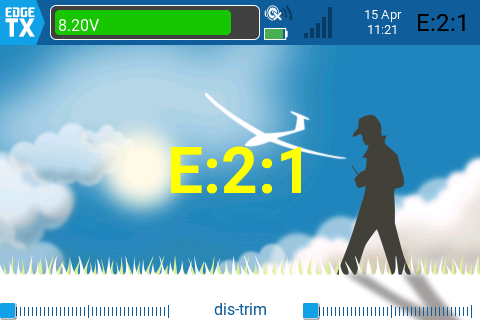
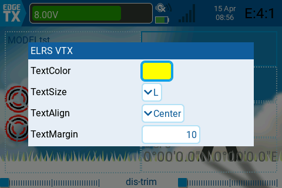

# ELRS VTX Widget for EdgeTX

An EdgeTX widget to display VTX band and channel information retrieved from an ELRS (ExpressLRS) TX module.


---

## English

### Overview
This project aims to create an EdgeTX Lua widget that communicates with an ELRS module to fetch and display its current VTX band and channel settings. 

### Background
When you change the VTX channel in ExpressLRS Lua or EasyVTXch Lua, that data is stored in the ELRS TX module. This data is transmitted when the ELRS TX establishes a link with the drone, causing the VTX channel to change. The motivation for creating this widget was to provide a convenient way to view that data without having to launch ExpressLRS Lua every time you start up the transmitter.

### Features
*   **ELRS Communication:** Directly queries the ELRS module for VTX band and channel data.
*   **EdgeTX Widget:** Designed to run as a standalone widget on EdgeTX radios.
*   **Customizable Display:** Allows configuration of text color, text size, and display position.


### Installation
Store `main.lua` in the following path on the transmitter's SD card:
```/WIDGETS/ELRSVTX/main.lua```

### Configuration
The widget offers several configuration options to customize its appearance. These settings can be accessed through the EdgeTX radio's widget settings menu.



Note: The BOLD font size for TextSize is the same as STD, and the same applies to XXS and XS.


---

## 日本語

### 概要
ELRS (ExpressLRS) TXモジュールからVTXに送るバンドとチャネル設定を取得し表示するEdgeTXのウィジェットです。

### 背景
ExpressLRS LuaあるいはEasyVTXch LuaなどでVTXチャネルを変更するとELRS TXモジュールに、そのデータは記憶されます。そのデータはELRS TXがドローンとのリンクが確立した際に送付されVTXチャネルが変更されます。そのため送信機を立ち上げた時にExpressLRS Luaを起動することなく、そのデータが確認できると便利だというのが、このウィジェット作成の動機です。

### 機能
*   **ELRS通信:** ELRなS TXモジュールに直接問い合わせてVTXのバンドとチャネルデータを取得します。
*   **EdgeTXウィジェット:** EdgeTX送信機上でウィジェットとして動作するように設計されています。
*   **カスタマイズ可能な表示:** 文字色、文字サイズ、表示位置などを設定可能です。

### 導入
送信機のSDカードの以下のパスにmain.luaを保管します。
```/WIDGETS/ELRSVTX/main.lua```

### 設定
このウィジェットは、表示をカスタマイズするためのいくつかの設定オプションを提供します。これらの設定は、EdgeTX送信機のウィジェット設定メニューからアクセスできます。


注: TextSizeのBOLDはSTDと同じ、XXSとXSも同じになります。
